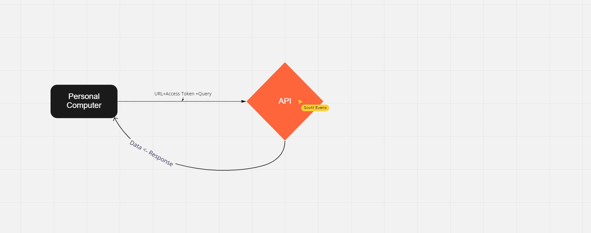

# Project Name

**Author**: Anthony Hill
**Version**: 1.0.0 (increment the patch/fix version number if you make more commits past your first submission)

## Overview
<!-- Provide a high level overview of what this application is and why you are building it, beyond the fact that it's an assignment for this class. (i.e. What's your problem domain?) -->

## Getting Started
<!-- What are the steps that a user must take in order to build this app on their own machine and get it running? -->

## Architecture
<!-- Provide a detailed description of the application design. What technologies (languages, libraries, etc) you're using, and any other relevant design information. -->

## Change Log
Version 1. Search bar functionality as well as map population. as well as error handling. 

## Credit and Collaborations
Scott evans for creating the miro screenshot with me. 
Liesel White for always being a sounding board back and forth
David Heckler for putting up with me and my confusion